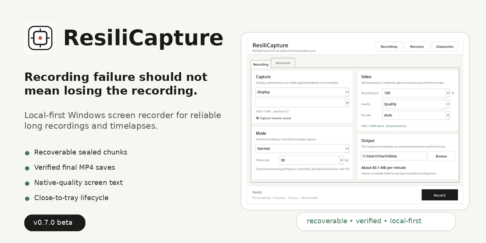
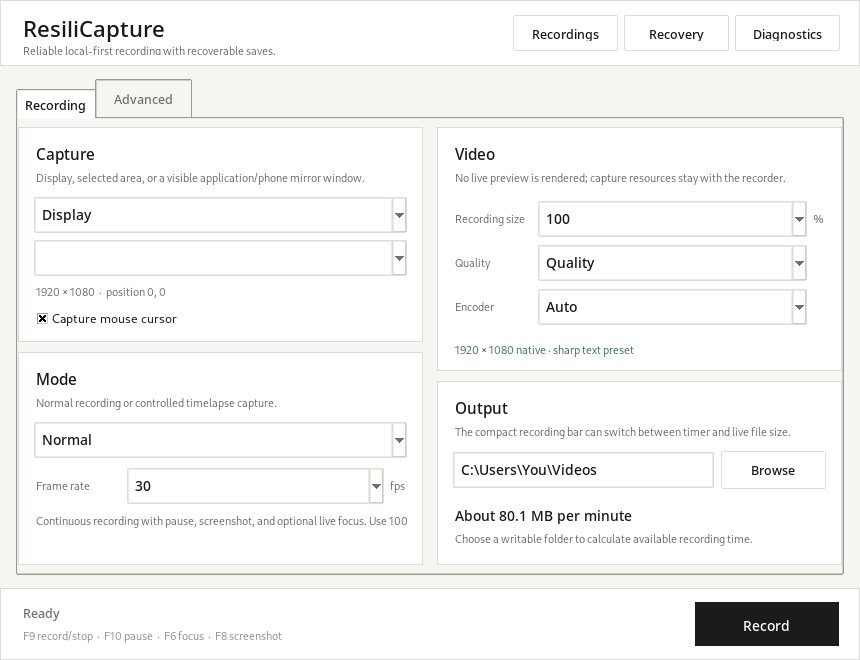

# ResiliCapture

[](https://github.com/awmhathif/ResiliCapture/actions/workflows/test.yml)
[](LICENSE.txt)

**A local-first Windows screen recorder designed not to lose long recordings.**

ResiliCapture records normal screen video and long timelapses using independently sealed recovery chunks, then verifies the final MP4 before it reports success. There is no account, no cloud upload, and no mandatory editor/export step.

<p align="center">
  
</p>

<p align="center">
  <a href="../../releases/latest"><strong>Download the latest Windows release</strong></a>
  · <a href="PRIVACY.md">Privacy</a>
  · <a href="SECURITY.md">Security</a>
  · <a href="CONTRIBUTING.md">Contributing</a>
</p>

> **Beta status — v0.7.0.** The recorder/recovery model is functional and covered by automated tests, but 1.0 is reserved for process isolation plus long Windows soak/hardware-matrix testing. See [Roadmap](ROADMAP.md).

## Why ResiliCapture?

Most screen recorders optimize for editing features. ResiliCapture puts recording durability first:

- **Recoverable recording chunks.** Completed chunks are sealed independently, so an interrupted session does not automatically mean losing everything.
- **Verified saves.** The UI only says **Saved and verified** after the final output passes media checks.
- **Long-timelapse scaling.** Chunk duration adapts to long capture intervals instead of spawning thousands of tiny encoder jobs.
- **Fast finalization.** Ordinary H.264 sessions use manifest/journal metadata and stream-copy concat instead of probing/re-encoding every chunk.
- **Disk-space protection.** Finalization refuses unsafe writes while keeping source chunks recoverable.
- **Tray-safe lifecycle.** Clicking **X** sends the app to the tray; explicit Exit is the full shutdown command.
- **Sharp desktop capture.** Fresh installs use 100% native resolution + Quality, with screen-text-oriented H.264 presets.
- **Local-first privacy.** ResiliCapture does not require an account and contains no telemetry/cloud-upload path.

## Interface

<p align="center">
  
</p>

The public-beta defaults shown above use **100% native resolution** and **Quality** so desktop text stays sharp. Reduced output sizes are explicitly labeled as downscaled in the app.

## What it records

**Normal recording**

- Display, selected area, or visible window / phone mirror
- 10, 15, 24, 30, or 60 FPS
- 25%, 50%, 75%, or 100% output scale
- Performance, Balanced, Quality, and Near-lossless presets
- Automatic, software H.264, or detected hardware H.264 encoder
- Pause/resume, screenshots, optional live focus/zoom, countdown, duration limit

**Timelapse**

- Capture interval from 0.1 to 3600 seconds
- Independent 15/24/30/60 FPS playback rate
- Speed-up and output-duration estimate
- Same quality, scale, encoder, pause, screenshot, storage, and recovery controls

Example: capturing every 2 seconds and playing at 30 FPS is roughly **60×**, so one real hour becomes about one output minute.

## Safety model

During recording, ResiliCapture writes recoverable chunks into a hidden session directory:

```text
.resilicapture_sessions\<session-id>\
├── session.json
├── segments.jsonl
├── events.jsonl
├── stats.json
├── finalization.json
├── session.log
├── encoder.log
├── segment_000001.mkv
└── ...
```

Segment/event journals are append-only. A partially written final JSONL record after a crash can be ignored while earlier sealed records remain readable.

On Stop:

1. The active chunk is sealed.
2. ResiliCapture checks finalization disk headroom.
3. Ordinary compatible H.264 chunks are concatenated without a quality-reducing second encode.
4. The final MP4 is probed and can decode-check frames near the beginning and end.
5. Only then is the temporary output atomically renamed to the final filename and reported as **Saved and verified**.

If finalization fails, the sealed chunks are retained for recovery.

## System tray behavior

Closing the main window does **not** fully exit ResiliCapture. It sends the app to the system tray.

Tray actions:

- Show ResiliCapture
- Pause / Resume
- Stop & Save
- Open Recordings
- Exit ResiliCapture

If a recording is active, explicit Exit can stop/save first and wait for verification before shutting down. If tray integration cannot start, close falls back to taskbar minimization so the app does not become unreachable.

## Encoder fallback

Runtime fallback order:

```text
hardware H.264 → software libx264 → emergency OpenCV MJPEG
```

Keeping fallback in H.264 where possible preserves the fast, no-reencode finalization path.

FFmpeg is strongly recommended. ResiliCapture can use `ffmpeg.exe` and `ffprobe.exe` from `bin\` or from PATH. Official public binaries should follow the redistribution notes in [THIRD_PARTY_NOTICES.md](THIRD_PARTY_NOTICES.md).

## Recovery Center

The Recovery Center detects interrupted sessions and can rebuild a final MP4 from sealed chunks. It also attempts to rescue a readable active `.part` chunk when possible.

Recovery data is treated as source material: failed finalization does **not** delete it.

## Diagnostics

The app can create a sanitized diagnostic ZIP for GitHub issues. It can include runtime metadata and selected logs, but intentionally excludes:

- recordings and video chunks
- screenshots/captured frames
- known full home/save/session paths

Always review diagnostic material before posting it publicly.

## Run from source

Requirements:

- Windows 10 or Windows 11
- Python 3.11–3.13
- FFmpeg strongly recommended

```bat
install_dev.bat
run.bat
```

For local bundled builds, place `ffmpeg.exe` and `ffprobe.exe` under `bin\`. Do not redistribute an arbitrary FFmpeg build without reviewing its exact license/configuration.

## Build the Windows app

```bat
build_windows.bat
```

The build script installs build dependencies, compiles sources, runs the automated suite, builds a PyInstaller one-folder app, creates the Windows ZIP, and writes SHA-256.

Expected outputs:

```text
dist\ResiliCapture\ResiliCapture.exe
dist\ResiliCapture-0.7.0-Windows.zip
dist\ResiliCapture-0.7.0-Windows.zip.sha256
```

UPX is disabled for release builds.

## Keyboard controls

| Key | Action |
| --- | --- |
| `F9` | Record / stop |
| `F10` | Pause / resume |
| `F6` | Start focus / return to full screen |
| `F8` | Screenshot |

## Development and validation

The test suite covers recording/finalization, timelapse, live focus, quality defaults, fast finalization scaling, append-only journals, truncated journal tails, disk-space refusal, tray lifecycle, diagnostics privacy, and upgrade compatibility.

```bat
test_windows.bat
```

GitHub Actions validates the project on Windows with Python 3.11, 3.12, and 3.13 and also performs a PyInstaller package smoke build.

## Migrating from pre-release FocusFlow builds

ResiliCapture is the continuation/rebrand of the earlier **FocusFlow Recorder 0.6.x** pre-release builds.

- On first launch, if ResiliCapture has no settings yet, it can import existing FocusFlow Recorder settings from the legacy app-data folder.
- New recovery sessions use `.resilicapture_sessions`.
- The Recovery Center scans both `.resilicapture_sessions` **and legacy `.focusflow_sessions`**, so old interrupted recordings remain recoverable without moving or rewriting them.
- Old FocusFlow app-data/session folders are intentionally left untouched for rollback and manual recovery.

## Project principles

1. **Never report success before final media verification.**
2. **Never delete recoverable source chunks because finalization failed.**
3. **Keep recording local-first and privacy-preserving by default.**
4. **Prefer boring, recoverable state transitions over clever destructive shortcuts.**

## Roadmap

The largest remaining 1.0 milestone is moving capture/finalization out of the Tk GUI process so a UI/native crash cannot terminate the recorder. The other 1.0 gates are 12–24 hour Windows soak tests, an NVENC/QSV/AMF hardware matrix, signed installer strategy, and a finalized FFmpeg redistribution decision.

See [ROADMAP.md](ROADMAP.md) and [KNOWN_LIMITATIONS.md](KNOWN_LIMITATIONS.md).

## Contributing

Bug reports and reliability improvements are welcome. Please read [CONTRIBUTING.md](CONTRIBUTING.md), [SECURITY.md](SECURITY.md), and [CODE_OF_CONDUCT.md](CODE_OF_CONDUCT.md) before opening a pull request.

## License

ResiliCapture source is MIT licensed. See [LICENSE.txt](LICENSE.txt). Third-party components retain their own licenses; see [THIRD_PARTY_NOTICES.md](THIRD_PARTY_NOTICES.md).
